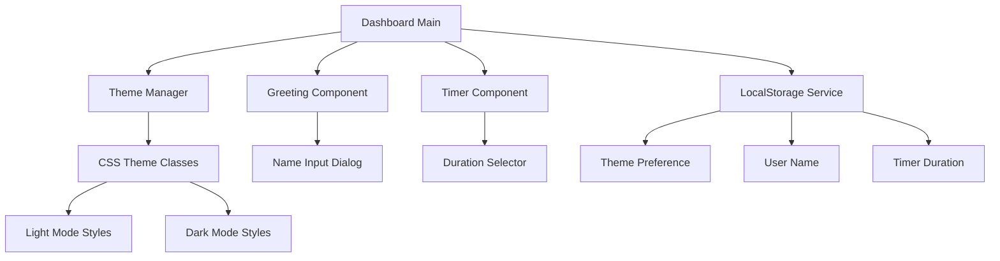
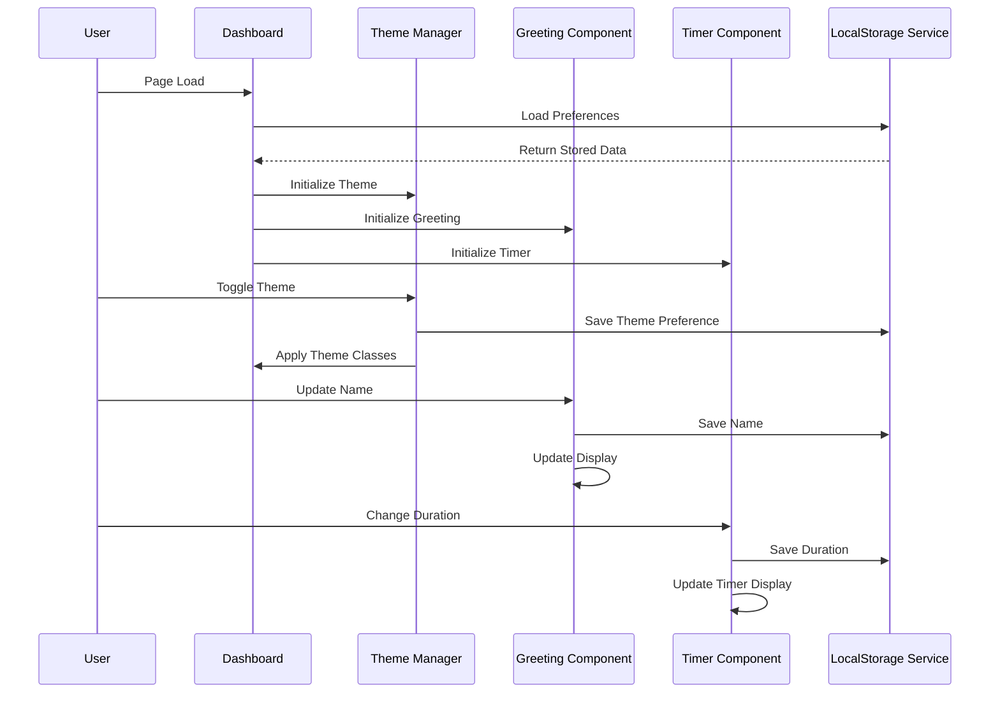

# Design Document: Productivity Dashboard Enhancements

## Overview

This design document outlines the technical implementation for enhancing the existing Productivity Dashboard with three key features: Light/Dark Mode toggle, Custom Name in Greeting, and Customizable Pomodoro Timer Duration. The enhancements will integrate seamlessly with the existing codebase while maintaining the current architecture and functionality.

The design follows a component-based approach, leveraging the existing LocalStorageService for data persistence and maintaining the constraint of single CSS and JavaScript files. All new features will be implemented as extensions to the current system rather than replacements, ensuring backward compatibility and code maintainability.

## Architecture

### System Architecture Overview

The enhanced dashboard maintains the existing single-page application architecture with the following key components:



### Component Integration Strategy

The enhancements will integrate with the existing architecture through:

1. **Extension Pattern**: New functionality extends existing components rather than replacing them
2. **Service Integration**: All persistence operations use the existing LocalStorageService
3. **Event-Driven Updates**: Components communicate through custom events to maintain loose coupling
4. **CSS Variable System**: Theme switching uses CSS custom properties for efficient style updates

### Data Flow Architecture



## Components and Interfaces

### Theme Manager Component

**Purpose**: Manages light and dark mode switching with persistence

**Interface**:
```javascript
class ThemeManager {
    constructor(localStorageService)
    getCurrentTheme(): string
    setTheme(theme: string): void
    toggleTheme(): void
    initializeTheme(): void
}
```

**Key Methods**:
- `initializeTheme()`: Loads saved theme or defaults to light mode
- `toggleTheme()`: Switches between light and dark modes
- `setTheme(theme)`: Applies specific theme and saves preference

**Events Emitted**:
- `theme-changed`: Fired when theme is updated with new theme value

### Enhanced Greeting Component

**Purpose**: Displays personalized time-based greetings with user name

**Interface**:
```javascript
class GreetingComponent {
    constructor(localStorageService)
    getUserName(): string
    setUserName(name: string): void
    promptForName(): void
    updateGreeting(): void
    getTimeBasedGreeting(): string
}
```

**Key Methods**:
- `promptForName()`: Shows name input dialog for first-time users
- `setUserName(name)`: Updates and persists user name
- `updateGreeting()`: Refreshes greeting display with current time and name

**Events Emitted**:
- `name-updated`: Fired when user name is changed

### Enhanced Timer Component

**Purpose**: Manages Pomodoro timer with customizable durations

**Interface**:
```javascript
class TimerComponent {
    constructor(localStorageService)
    getDuration(): number
    setDuration(minutes: number): void
    start(): void
    stop(): void
    reset(): void
    updateDisplay(): void
}
```

**Key Methods**:
- `setDuration(minutes)`: Updates timer duration and saves preference
- `reset()`: Resets timer to currently selected duration
- `updateDisplay()`: Refreshes timer display with current time and duration

**Events Emitted**:
- `duration-changed`: Fired when timer duration is updated
- `timer-state-changed`: Fired when timer starts, stops, or resets

### LocalStorage Service Extensions

**Purpose**: Extends existing service to handle new preference types

**New Methods**:
```javascript
// Theme management
getThemePreference(): string
setThemePreference(theme: string): void

// User name management  
getUserName(): string
setUserName(name: string): void

// Timer duration management
getTimerDuration(): number
setTimerDuration(minutes: number): void
```

**Storage Keys**:
- `dashboard-theme`: Stores theme preference ('light' or 'dark')
- `dashboard-user-name`: Stores user's display name
- `dashboard-timer-duration`: Stores preferred timer duration in minutes

## Data Models

### Theme Preference Model

```javascript
const ThemePreference = {
    LIGHT: 'light',
    DARK: 'dark',
    DEFAULT: 'light'
};
```

**Validation Rules**:
- Must be either 'light' or 'dark'
- Defaults to 'light' if invalid or missing

### User Profile Model

```javascript
const UserProfile = {
    name: string,           // User's display name
    created: timestamp,     // When profile was created
    lastUpdated: timestamp  // When name was last changed
};
```

**Validation Rules**:
- Name must be non-empty string after trimming
- Name length between 1-50 characters
- Special characters allowed but HTML entities escaped

### Timer Configuration Model

```javascript
const TimerConfig = {
    duration: number,       // Duration in minutes
    availableOptions: [25, 30, 45],  // Allowed duration values
    default: 25            // Default duration
};
```

**Validation Rules**:
- Duration must be one of the available options (25, 30, 45)
- Defaults to 25 minutes if invalid or missing
- Must be positive integer

### Application State Model

```javascript
const AppState = {
    theme: ThemePreference,
    user: UserProfile,
    timer: TimerConfig,
    initialized: boolean
};
```

**State Management**:
- Centralized state object for all preferences
- Immutable updates through dedicated methods
- Automatic persistence on state changes

## Correctness Properties

*A property is a characteristic or behavior that should hold true across all valid executions of a system-essentially, a formal statement about what the system should do. Properties serve as the bridge between human-readable specifications and machine-verifiable correctness guarantees.*

### Property 1: Theme Toggle Behavior

*For any* theme toggle click event, the Theme Manager should switch to the opposite theme (light to dark, or dark to light).

**Validates: Requirements 1.2**

### Property 2: Theme CSS Class Application

*For any* theme setting (light or dark), the Theme Manager should apply the corresponding CSS class to the document body.

**Validates: Requirements 1.3**

### Property 3: Theme Persistence

*For any* theme selection, the LocalStorage Service should immediately save the theme preference to localStorage.

**Validates: Requirements 1.4, 5.1**

### Property 4: Theme Restoration

*For any* saved theme preference, when the Theme Manager initializes, it should restore and apply the previously saved theme.

**Validates: Requirements 1.5**

### Property 5: Greeting Format with Name

*For any* valid user name, the Greeting Component should display the greeting in "Good [Time], [Name]" format where [Time] is the appropriate time-based greeting.

**Validates: Requirements 2.2**

### Property 6: Name Persistence

*For any* valid user name, the LocalStorage Service should immediately save the name to localStorage when set.

**Validates: Requirements 2.3, 5.2**

### Property 7: Name Restoration

*For any* saved user name, when the Greeting Component initializes, it should load and display the stored name in the greeting.

**Validates: Requirements 2.4**

### Property 8: Name Validation

*For any* string composed entirely of whitespace or empty string, the Greeting Component should reject the input and not save it to localStorage.

**Validates: Requirements 2.7**

### Property 9: Timer Display Update

*For any* duration selection from the available options (25, 30, 45 minutes), the Timer Component should immediately update the display to show the new duration.

**Validates: Requirements 3.2**

### Property 10: Timer Button Functionality

*For any* selected timer duration, the Start, Stop, and Reset buttons should maintain their functionality without errors.

**Validates: Requirements 3.3**

### Property 11: Timer Duration Persistence

*For any* duration selection, the LocalStorage Service should immediately save the duration preference to localStorage.

**Validates: Requirements 3.4, 5.3**

### Property 12: Timer Duration Restoration

*For any* saved timer duration, when the Timer Component initializes, it should restore and display the previously saved duration.

**Validates: Requirements 3.5**

### Property 13: Timer Reset Behavior

*For any* currently selected duration, when the timer is reset, it should return to the full duration of the currently selected setting.

**Validates: Requirements 3.7**

## Error Handling

### LocalStorage Error Handling

The application must gracefully handle localStorage failures through a comprehensive error handling strategy:

**Error Scenarios**:
1. **Storage Quota Exceeded**: When localStorage is full
2. **Storage Disabled**: When localStorage is disabled by user/browser settings
3. **Storage Unavailable**: When localStorage API is not supported
4. **Corrupt Data**: When stored data is malformed or invalid

**Fallback Strategy**:
```javascript
class LocalStorageService {
    safeGet(key, defaultValue) {
        try {
            const value = localStorage.getItem(key);
            return value ? JSON.parse(value) : defaultValue;
        } catch (error) {
            console.warn(`LocalStorage read error for ${key}:`, error);
            return defaultValue;
        }
    }
    
    safeSet(key, value) {
        try {
            localStorage.setItem(key, JSON.stringify(value));
            return true;
        } catch (error) {
            console.warn(`LocalStorage write error for ${key}:`, error);
            return false;
        }
    }
}
```

### Theme Error Handling

**Invalid Theme Values**: If stored theme is corrupted or invalid, default to light mode
**CSS Loading Failures**: Ensure basic styling works even if theme-specific CSS fails to load
**Toggle Failures**: If theme switching fails, maintain current theme and log error

### Name Input Error Handling

**Empty Name Validation**: Reject empty or whitespace-only names with user feedback
**Special Character Handling**: Sanitize input to prevent XSS while preserving international characters
**Storage Failures**: If name cannot be saved, inform user and allow retry

### Timer Error Handling

**Invalid Duration Values**: If stored duration is invalid, default to 25 minutes
**Timer State Corruption**: If timer state becomes invalid, reset to stopped state with default duration
**Display Update Failures**: Ensure timer continues running even if display updates fail

## Testing Strategy

### Dual Testing Approach

The testing strategy employs both unit testing and property-based testing to ensure comprehensive coverage:

**Unit Tests**: Focus on specific examples, edge cases, and integration points
- Theme toggle button presence and functionality
- Default behavior when no preferences exist
- Error handling scenarios (localStorage unavailable, invalid data)
- UI component integration and event handling
- File structure constraints (single CSS/JS files)

**Property Tests**: Verify universal properties across all valid inputs
- Theme switching behavior for any theme state
- Preference persistence for any valid input values
- Component initialization with any stored preferences
- Input validation for any user-provided data
- Round-trip persistence (save then load) for all preference types

### Property-Based Testing Configuration

**Testing Library**: Use `fast-check` for JavaScript property-based testing
**Test Configuration**: Minimum 100 iterations per property test
**Test Tagging**: Each property test references its corresponding design property

**Example Property Test Structure**:
```javascript
// Feature: productivity-dashboard-enhancements, Property 1: Theme Toggle Behavior
fc.test('theme toggle switches between light and dark', fc.constantFrom('light', 'dark'), (currentTheme) => {
    const themeManager = new ThemeManager(mockLocalStorageService);
    themeManager.setTheme(currentTheme);
    themeManager.toggleTheme();
    const newTheme = themeManager.getCurrentTheme();
    expect(newTheme).toBe(currentTheme === 'light' ? 'dark' : 'light');
});
```

### Test Coverage Requirements

**Unit Test Coverage**:
- All public methods of new components
- Error handling paths and fallback behaviors
- UI event handlers and user interactions
- Integration with existing LocalStorageService
- Default value initialization

**Property Test Coverage**:
- All 13 correctness properties defined in this document
- Input validation for all user-provided data
- Persistence round-trip testing for all preferences
- State transitions for theme and timer components
- Cross-browser localStorage compatibility

### Integration Testing

**Component Integration**: Test interaction between Theme Manager, Greeting Component, and Timer Component
**Service Integration**: Verify all components properly use LocalStorageService
**UI Integration**: Test that all new UI elements integrate with existing dashboard layout
**Performance Testing**: Ensure preference loading/saving doesn't impact dashboard responsiveness