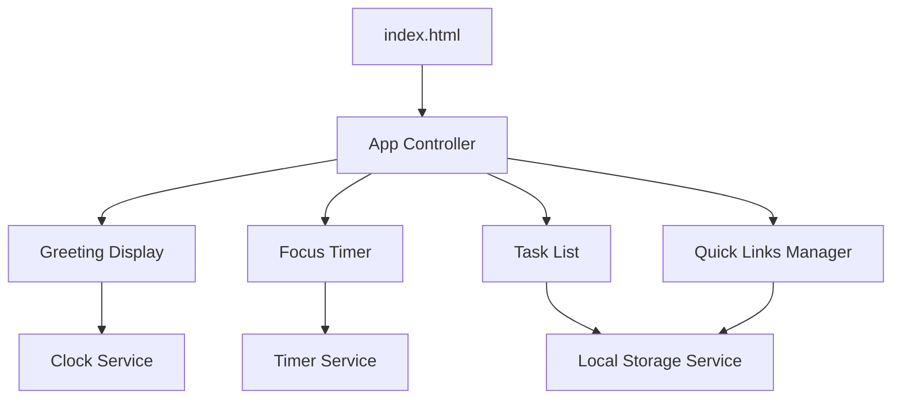

# Design Document: Productivity Dashboard

## Overview

The Productivity Dashboard is a client-side web application built with vanilla JavaScript, HTML, and CSS. The application provides four main components: a greeting display with current time/date, a 25-minute focus timer, a task list manager, and a quick links manager. All data persists in the browser's Local Storage, making the application fully functional without a backend server.

The design prioritizes simplicity, maintainability, and browser compatibility. By using only standard Web APIs and avoiding frameworks, the application remains lightweight and accessible across all modern browsers.

### Key Design Principles

- **Zero Dependencies**: Pure vanilla JavaScript with no external libraries or frameworks
- **Single File Architecture**: One HTML file, one CSS file, one JavaScript file
- **Local-First**: All data stored in browser Local Storage
- **Component-Based**: Logical separation of concerns despite single-file structure
- **Progressive Enhancement**: Core functionality works without advanced features

## Architecture

### Application Structure

```
productivity-dashboard/
├── index.html          # Main entry point
├── css/
│   └── styles.css      # All styling
└── js/
    └── app.js          # All application logic
```

### Component Architecture

The application follows a component-based architecture implemented through JavaScript modules and classes:



### Execution Flow

1. **Initialization**: HTML loads and executes app.js
2. **Component Registration**: Each component initializes and registers event listeners
3. **Data Loading**: Components load persisted data from Local Storage
4. **Render**: Initial UI render with loaded data
5. **Event Loop**: Components respond to user interactions and timer events
6. **Persistence**: Data changes automatically save to Local Storage

### State Management

State is managed locally within each component:

- **Greeting Display**: No persistent state (derives from current time)
- **Focus Timer**: In-memory state (timer value, running status)
- **Task List**: Persistent state in Local Storage (array of task objects)
- **Quick Links Manager**: Persistent state in Local Storage (array of link objects)

## Components and Interfaces

### 1. App Controller

**Responsibility**: Initialize and coordinate all components

**Interface**:
```javascript
class App {
  constructor()
  init()
  // Initializes all components on DOMContentLoaded
}
```

### 2. Greeting Display Component

**Responsibility**: Display current time, date, and time-based greeting

**Interface**:
```javascript
class GreetingDisplay {
  constructor(containerElement)
  init()
  updateTime()
  getGreeting(hour)
  formatTime(date)
  formatDate(date)
  destroy()
}
```

**DOM Structure**:
```html
<div class="greeting-display">
  <div class="greeting-text">Good Morning</div>
  <div class="current-time">09:45 AM</div>
  <div class="current-date">Monday, January 15</div>
</div>
```

**Behavior**:
- Updates every second using `setInterval`
- Determines greeting based on current hour
- Formats time in 12-hour format with leading zeros
- Formats date with day of week, month name, and day

### 3. Focus Timer Component

**Responsibility**: Provide 25-minute countdown timer with start/stop/reset controls

**Interface**:
```javascript
class FocusTimer {
  constructor(containerElement)
  init()
  start()
  stop()
  reset()
  tick()
  formatTime(totalSeconds)
  render()
  destroy()
}
```

**State**:
```javascript
{
  remainingSeconds: 1500,  // 25 minutes in seconds
  isRunning: false,
  intervalId: null
}
```

**DOM Structure**:
```html
<div class="focus-timer">
  <div class="timer-display">25:00</div>
  <div class="timer-controls">
    <button class="btn-start">Start</button>
    <button class="btn-stop">Stop</button>
    <button class="btn-reset">Reset</button>
  </div>
</div>
```

**Behavior**:
- Initializes at 1500 seconds (25 minutes)
- Start: begins countdown using `setInterval`
- Stop: pauses countdown, preserves remaining time
- Reset: returns to 1500 seconds, stops countdown
- Automatically stops at zero
- Updates display every second while running

### 4. Task List Component

**Responsibility**: Manage task creation, editing, completion, and deletion

**Interface**:
```javascript
class TaskList {
  constructor(containerElement)
  init()
  loadTasks()
  saveTasks()
  addTask(text)
  toggleTask(taskId)
  editTask(taskId, newText)
  deleteTask(taskId)
  render()
  destroy()
}
```

**State**:
```javascript
{
  tasks: [
    {
      id: "uuid-string",
      text: "Task description",
      completed: false,
      createdAt: timestamp
    }
  ]
}
```

**DOM Structure**:
```html
<div class="task-list">
  <div class="task-input-container">
    <input type="text" class="task-input" placeholder="Add a new task...">
    <button class="btn-add-task">Add</button>
  </div>
  <ul class="tasks">
    <li class="task-item" data-task-id="uuid">
      <input type="checkbox" class="task-checkbox">
      <span class="task-text">Task description</span>
      <button class="btn-edit-task">Edit</button>
      <button class="btn-delete-task">Delete</button>
    </li>
  </ul>
</div>
```

**Behavior**:
- Generates unique IDs for tasks using timestamp + random
- Validates non-empty input before creating tasks
- Toggles completion status on checkbox click
- Inline editing with input field replacement
- Persists to Local Storage after every change
- Loads from Local Storage on initialization

### 5. Quick Links Manager Component

**Responsibility**: Manage quick link creation and deletion

**Interface**:
```javascript
class QuickLinksManager {
  constructor(containerElement)
  init()
  loadLinks()
  saveLinks()
  addLink(name, url)
  deleteLink(linkId)
  validateUrl(url)
  render()
  destroy()
}
```

**State**:
```javascript
{
  links: [
    {
      id: "uuid-string",
      name: "Display Name",
      url: "https://example.com",
      createdAt: timestamp
    }
  ]
}
```

**DOM Structure**:
```html
<div class="quick-links-manager">
  <div class="link-input-container">
    <input type="text" class="link-name-input" placeholder="Link name">
    <input type="url" class="link-url-input" placeholder="https://example.com">
    <button class="btn-add-link">Add Link</button>
  </div>
  <div class="links">
    <div class="link-item" data-link-id="uuid">
      <a href="url" target="_blank" class="link-button">Display Name</a>
      <button class="btn-delete-link">Delete</button>
    </div>
  </div>
</div>
```

**Behavior**:
- Generates unique IDs for links using timestamp + random
- Validates non-empty name and URL before creating links
- Basic URL validation (checks for http:// or https:// prefix)
- Opens links in new tab using `target="_blank"`
- Persists to Local Storage after every change
- Loads from Local Storage on initialization

### 6. Local Storage Service

**Responsibility**: Centralized interface for Local Storage operations

**Interface**:
```javascript
class LocalStorageService {
  static get(key)
  static set(key, value)
  static remove(key)
  static clear()
}
```

**Storage Keys**:
- `productivity-dashboard-tasks`: Task array
- `productivity-dashboard-links`: Link array

**Behavior**:
- Serializes objects to JSON before storing
- Deserializes JSON when retrieving
- Returns null for missing keys
- Handles storage errors gracefully

## Data Models

### Task Model

```javascript
{
  id: String,           // Unique identifier (timestamp + random)
  text: String,         // Task description (non-empty)
  completed: Boolean,   // Completion status
  createdAt: Number     // Unix timestamp
}
```

**Validation Rules**:
- `id`: Must be unique, generated automatically
- `text`: Must be non-empty string after trimming whitespace
- `completed`: Must be boolean, defaults to false
- `createdAt`: Must be valid Unix timestamp

### Link Model

```javascript
{
  id: String,           // Unique identifier (timestamp + random)
  name: String,         // Display name (non-empty)
  url: String,          // Valid URL with protocol
  createdAt: Number     // Unix timestamp
}
```

**Validation Rules**:
- `id`: Must be unique, generated automatically
- `name`: Must be non-empty string after trimming whitespace
- `url`: Must be non-empty string starting with http:// or https://
- `createdAt`: Must be valid Unix timestamp

### Timer State Model

```javascript
{
  remainingSeconds: Number,  // 0 to 1500
  isRunning: Boolean,        // Timer active status
  intervalId: Number|null    // setInterval reference
}
```

**Validation Rules**:
- `remainingSeconds`: Must be integer between 0 and 1500
- `isRunning`: Must be boolean
- `intervalId`: Must be valid interval ID or null

## Correctness Properties

*A property is a characteristic or behavior that should hold true across all valid executions of a system—essentially, a formal statement about what the system should do. Properties serve as the bridge between human-readable specifications and machine-verifiable correctness guarantees.*


### Property 1: Time Format Correctness

*For any* valid Date object, the formatted time string should be in 12-hour format with AM/PM indicator and include leading zeros for single-digit hours and minutes (format: HH:MM AM/PM).

**Validates: Requirements 1.1, 1.4**

### Property 2: Date Format Completeness

*For any* valid Date object, the formatted date string should include the day of week, month name, and day number.

**Validates: Requirements 1.2**

### Property 3: Greeting Time Range Mapping

*For any* hour value (0-23), the greeting function should return exactly one of "Good Morning" (5-11), "Good Afternoon" (12-16), "Good Evening" (17-20), or "Good Night" (21-4), with no gaps or overlaps in coverage.

**Validates: Requirements 2.1, 2.2, 2.3, 2.4**

### Property 4: Timer Format Correctness

*For any* valid number of seconds (0-1500), the timer display format should be MM:SS with leading zeros.

**Validates: Requirements 3.7**

### Property 5: Timer Start Preserves Remaining Time

*For any* timer state with remaining seconds, starting the timer should begin countdown from that exact remaining time value.

**Validates: Requirements 3.2**

### Property 6: Timer Stop Preserves Remaining Time

*For any* running timer state, stopping the timer should preserve the current remaining seconds value without modification.

**Validates: Requirements 3.3**

### Property 7: Timer Reset Returns to Initial State

*For any* timer state (running or stopped, any remaining time), resetting should return the timer to 1500 seconds and stopped state.

**Validates: Requirements 3.4**

### Property 8: Valid Task Creation Succeeds

*For any* non-empty, non-whitespace string, creating a task with that text should result in a new task appearing in the task list with matching text.

**Validates: Requirements 4.2, 4.5**

### Property 9: Invalid Task Creation Rejected

*For any* string composed entirely of whitespace characters (spaces, tabs, newlines) or empty string, attempting to create a task should be rejected and the task list should remain unchanged.

**Validates: Requirements 4.3**

### Property 10: Task Creation Clears Input

*For any* valid task text, after successfully creating a task, the input field should be empty.

**Validates: Requirements 4.4**

### Property 11: Task UI Controls Present

*For any* task in the task list, the rendered DOM should include a completion indicator (checkbox), edit control (button), and delete control (button).

**Validates: Requirements 5.1, 6.1, 7.1**

### Property 12: Task Toggle Bidirectional

*For any* task, toggling completion status twice should return the task to its original completion state (incomplete → complete → incomplete, or complete → incomplete → complete).

**Validates: Requirements 5.2, 5.3**

### Property 13: Task Edit Updates Text

*For any* task and any valid (non-empty, non-whitespace) new text, editing the task should update the task's text to the new value.

**Validates: Requirements 6.3**

### Property 14: Invalid Task Edit Rejected

*For any* task and any invalid edit text (empty or whitespace-only), attempting to edit should be rejected and the task text should remain unchanged.

**Validates: Requirements 6.4**

### Property 15: Task Deletion Removes Task

*For any* task list and any task in that list, deleting the task should result in a task list that does not contain that task.

**Validates: Requirements 7.2**

### Property 16: Task Mutations Persist

*For any* task list state, after performing any mutation operation (add, toggle, edit, delete), the resulting task list should be saved to Local Storage and retrievable.

**Validates: Requirements 4.6, 5.5, 6.5, 7.4**

### Property 17: Task Load Displays All Tasks

*For any* non-empty task collection stored in Local Storage, loading the dashboard should display all tasks from that collection.

**Validates: Requirements 8.1, 8.2**

### Property 18: Task Serialization Round Trip

*For any* valid task collection, saving to Local Storage then loading from Local Storage should produce an equivalent collection with all tasks having identical id, text, completed, and createdAt values.

**Validates: Requirements 8.4**

### Property 19: Valid Link Creation Succeeds

*For any* non-empty name and valid URL (starting with http:// or https://), creating a link should result in a new link appearing in the links list with matching name and URL.

**Validates: Requirements 9.2, 9.5**

### Property 20: Invalid Link Creation Rejected

*For any* combination where name is empty/whitespace or URL is empty/whitespace or URL lacks http:// or https:// prefix, attempting to create a link should be rejected and the links list should remain unchanged.

**Validates: Requirements 9.3**

### Property 21: Link Creation Clears Inputs

*For any* valid link name and URL, after successfully creating a link, both input fields should be empty.

**Validates: Requirements 9.4**

### Property 22: Link UI Structure Correct

*For any* link in the links list, the rendered DOM should include a clickable anchor element with target="_blank", the link name as text, and a delete control (button).

**Validates: Requirements 10.1, 10.2, 10.3, 11.1**

### Property 23: Link Deletion Removes Link

*For any* links list and any link in that list, deleting the link should result in a links list that does not contain that link.

**Validates: Requirements 11.2**

### Property 24: Link Mutations Persist

*For any* links list state, after performing any mutation operation (add, delete), the resulting links list should be saved to Local Storage and retrievable.

**Validates: Requirements 9.6, 11.4**

### Property 25: Link Load Displays All Links

*For any* non-empty link collection stored in Local Storage, loading the dashboard should display all links from that collection.

**Validates: Requirements 12.1, 12.2**

### Property 26: Link Serialization Round Trip

*For any* valid link collection, saving to Local Storage then loading from Local Storage should produce an equivalent collection with all links having identical id, name, url, and createdAt values.

**Validates: Requirements 12.4**

## Error Handling

### Local Storage Errors

**Scenario**: Local Storage is full or unavailable

**Handling**:
- Wrap all Local Storage operations in try-catch blocks
- Log errors to console for debugging
- Display user-friendly error message: "Unable to save data. Your changes may not persist."
- Continue operation without crashing (graceful degradation)
- Fallback: Keep data in memory for current session

**Implementation**:
```javascript
try {
  localStorage.setItem(key, value);
} catch (e) {
  console.error('Local Storage error:', e);
  this.showError('Unable to save data. Your changes may not persist.');
}
```

### Invalid Data in Local Storage

**Scenario**: Corrupted or invalid JSON in Local Storage

**Handling**:
- Wrap JSON.parse in try-catch blocks
- Log parsing errors to console
- Return empty array as fallback
- Clear corrupted data from storage
- Allow user to start fresh

**Implementation**:
```javascript
try {
  return JSON.parse(localStorage.getItem(key)) || [];
} catch (e) {
  console.error('Failed to parse stored data:', e);
  localStorage.removeItem(key);
  return [];
}
```

### Timer Interval Errors

**Scenario**: setInterval fails or behaves unexpectedly

**Handling**:
- Store interval ID and clear on component destroy
- Prevent multiple intervals from running simultaneously
- Check isRunning flag before starting new interval
- Clear interval when timer reaches zero

**Implementation**:
```javascript
if (this.intervalId) {
  clearInterval(this.intervalId);
}
this.intervalId = setInterval(() => this.tick(), 1000);
```

### Invalid User Input

**Scenario**: User submits invalid task text, link name, or URL

**Handling**:
- Validate input before processing
- Trim whitespace from inputs
- Check for empty strings after trimming
- Validate URL format (http:// or https:// prefix)
- Provide visual feedback for invalid input (red border, error message)
- Do not modify state or storage for invalid input

**Implementation**:
```javascript
const text = input.value.trim();
if (!text) {
  input.classList.add('error');
  return;
}
```

### DOM Element Not Found

**Scenario**: Required DOM element is missing

**Handling**:
- Check for element existence before operations
- Log error if critical element is missing
- Fail gracefully without crashing
- Provide meaningful error messages

**Implementation**:
```javascript
const container = document.querySelector('.task-list');
if (!container) {
  console.error('Task list container not found');
  return;
}
```

### Memory Leaks

**Scenario**: Event listeners or intervals not cleaned up

**Handling**:
- Implement destroy() method for each component
- Clear all intervals in destroy()
- Remove all event listeners in destroy()
- Call destroy() on page unload if needed

**Implementation**:
```javascript
destroy() {
  if (this.intervalId) {
    clearInterval(this.intervalId);
  }
  // Remove event listeners
  this.elements.forEach(el => {
    el.removeEventListener('click', this.handler);
  });
}
```

## Testing Strategy

### Overview

The testing strategy employs a dual approach combining unit tests for specific scenarios and property-based tests for comprehensive coverage. Unit tests verify concrete examples, edge cases, and integration points, while property-based tests validate universal properties across randomized inputs.

### Testing Framework Selection

**Unit Testing**: Jest (or Vitest for faster execution)
- Widely adopted, excellent documentation
- Built-in mocking and DOM testing support (jsdom)
- Snapshot testing for UI components
- Code coverage reporting

**Property-Based Testing**: fast-check
- Native JavaScript property-based testing library
- Integrates seamlessly with Jest/Vitest
- Configurable iteration counts
- Shrinking support for minimal failing examples

### Test Organization

```
tests/
├── unit/
│   ├── greeting-display.test.js
│   ├── focus-timer.test.js
│   ├── task-list.test.js
│   ├── quick-links-manager.test.js
│   └── local-storage-service.test.js
└── properties/
    ├── greeting-properties.test.js
    ├── timer-properties.test.js
    ├── task-properties.test.js
    └── link-properties.test.js
```

### Property-Based Testing Configuration

Each property test must:
- Run minimum 100 iterations (configured via fast-check)
- Include a comment tag referencing the design property
- Use appropriate generators for input data
- Verify the property holds for all generated inputs

**Tag Format**:
```javascript
// Feature: productivity-dashboard, Property 1: Time Format Correctness
test('time formatting produces correct 12-hour format', () => {
  fc.assert(
    fc.property(fc.date(), (date) => {
      const formatted = formatTime(date);
      expect(formatted).toMatch(/^\d{2}:\d{2} (AM|PM)$/);
    }),
    { numRuns: 100 }
  );
});
```

### Unit Testing Focus Areas

Unit tests should focus on:

1. **Specific Examples**: Concrete scenarios that demonstrate correct behavior
   - Timer initializes to 25:00
   - Empty task list displays correctly
   - Specific greeting at 9 AM is "Good Morning"

2. **Edge Cases**: Boundary conditions and special scenarios
   - Timer at zero stops counting
   - Empty Local Storage loads without errors
   - Single-digit hours/minutes have leading zeros

3. **Integration Points**: Component interactions
   - Timer updates trigger DOM updates
   - Task creation triggers Local Storage save
   - Component initialization loads from storage

4. **Error Conditions**: Failure scenarios
   - Local Storage quota exceeded
   - Invalid JSON in storage
   - Missing DOM elements

### Property-Based Testing Focus Areas

Property tests should verify:

1. **Format Properties**: Output format correctness across all inputs
   - Property 1: Time format (12-hour with AM/PM)
   - Property 2: Date format (day, month, date)
   - Property 4: Timer format (MM:SS)

2. **Round-Trip Properties**: Serialization/deserialization correctness
   - Property 18: Task serialization round trip
   - Property 26: Link serialization round trip

3. **State Preservation**: Operations that should preserve values
   - Property 6: Timer stop preserves time
   - Property 7: Timer reset returns to 1500

4. **Validation Properties**: Input validation across all inputs
   - Property 9: Invalid task creation rejected
   - Property 20: Invalid link creation rejected

5. **Bidirectional Properties**: Reversible operations
   - Property 12: Task toggle bidirectional

6. **Collection Properties**: Operations on collections
   - Property 15: Task deletion removes task
   - Property 23: Link deletion removes link

### Test Data Generators

**fast-check Generators**:

```javascript
// Task generator
const taskGen = fc.record({
  id: fc.string(),
  text: fc.string({ minLength: 1 }),
  completed: fc.boolean(),
  createdAt: fc.integer({ min: 0 })
});

// Link generator
const linkGen = fc.record({
  id: fc.string(),
  name: fc.string({ minLength: 1 }),
  url: fc.webUrl(),
  createdAt: fc.integer({ min: 0 })
});

// Whitespace string generator
const whitespaceGen = fc.stringOf(
  fc.constantFrom(' ', '\t', '\n', '\r')
);

// Hour generator (0-23)
const hourGen = fc.integer({ min: 0, max: 23 });

// Timer seconds generator (0-1500)
const timerSecondsGen = fc.integer({ min: 0, max: 1500 });
```

### Coverage Goals

- **Line Coverage**: Minimum 90%
- **Branch Coverage**: Minimum 85%
- **Function Coverage**: Minimum 95%
- **Property Coverage**: 100% of design properties tested

### Continuous Integration

Tests should run:
- On every commit (pre-commit hook)
- On pull requests (CI pipeline)
- Before deployment
- Nightly for extended property test runs (1000+ iterations)

### Manual Testing Checklist

Some requirements require manual verification:

**Performance (Requirement 13)**:
- [ ] Visual feedback appears within 100ms of user interaction
- [ ] Task operations feel responsive
- [ ] Link operations feel responsive
- [ ] Timer updates smoothly

**Browser Compatibility (Requirement 14)**:
- [ ] Chrome 90+ - all features work
- [ ] Firefox 88+ - all features work
- [ ] Edge 90+ - all features work
- [ ] Safari 14+ - all features work

**Code Structure (Requirement 15)**:
- [ ] Single CSS file in css/ directory
- [ ] Single JavaScript file in js/ directory
- [ ] Single HTML file as entry point
- [ ] HTML references only these files

### Testing Best Practices

1. **Avoid Over-Testing**: Don't write excessive unit tests for scenarios covered by property tests
2. **Test Behavior, Not Implementation**: Focus on what components do, not how they do it
3. **Isolate Components**: Mock dependencies and test components in isolation
4. **Fast Tests**: Keep unit tests fast (<1ms each) for rapid feedback
5. **Descriptive Names**: Test names should clearly describe what they verify
6. **Arrange-Act-Assert**: Structure tests clearly with setup, execution, and verification phases

